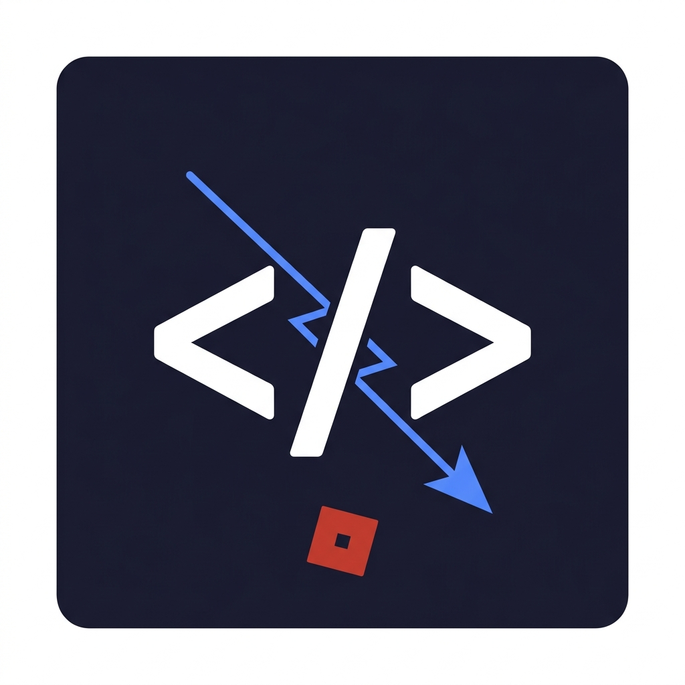

  

<h1 align="center">Roblox VSCode</h1>

  
  
  

---

## 🚀 The professional bridge between VS Code and Roblox Studio.

### [🌐 Official Website](https://roblox-vscode.wasmer.app) | [📖 Documentation](https://roblox-vscode.wasmer.app/docs.html)

Stop context-switching. Edit your Roblox scripts in the world's most powerful code editor with full multi-window support, real-time sync, and professional team monitoring.

*   **⚡ Professional UX:** Smooth animations, interactive onboarding, and custom themes in the Studio plugin.
*   **📖 Integrated Documentation:** Native VS Code walkthroughs and a comprehensive online manual.
*   **🚀 Differential Sync Engine:** High-performance FNV-1a hashing ensures only changed bytes are synced. 
*   **🔄 Bi-Directional Synchronisation:** Sync flows both ways with perfect line-ending normalization.
*   **📂 Canonical Pathing:** Shared sanitization rules ensure path consistency across platforms.
*   **🛡️ Studio Professional Suite:** Dockable panel with Activity Logs, Conflict Detection, and Undo support.
*   **📊 Sync Dashboard:** VS Code Webview with real-time stats and error diagnostics.

---

## ⌨️ Universal Keyboard Shortcuts
| Command | Keybind | Description |
| --- | --- | --- |
| `Start Bridge` | `Ctrl+Alt+R` | Launches the high-speed sync bridge. |
| `Push All`   | `Ctrl+Alt+U` | Pushes modified files to Studio (Differential). |
| `Sync Status` | `Ctrl+Alt+L` | Checks host/client connection health. |
| `Dashboard`   | `Ctrl+Alt+I` | Launches the Professional Sync Panel. |
| `Sync Docs`   | `Ctrl+Alt+H` | Opens the official interactive manual. |
| `Stop Bridge` | `Ctrl+Alt+X` | Stops/Kills the local server on your device. |
| `Team Members` | `Ctrl+Alt+T` | Lists everyone on this project's team. |

---

## 📦 Requirements & Setup

1. **Install the Roblox Plugin:** Download it from the [Roblox Creator Store](https://create.roblox.com/store/asset/133579566308901/Roblox-VSCode).
2. **Enable Permissions:** Open Studio Game Settings and enable **Allow HTTP Requests**.
3. **Launch Bridge:** Press **Ctrl+Alt+R** in VS Code to start the local sync bridge.
4. **Follow the Tutorial:** An interactive walkthrough will guide you through the first connection automatically.

---

  <b>Developed by CodingJeff</b> 
  <i>Official Release v1.0.1</i>

#
